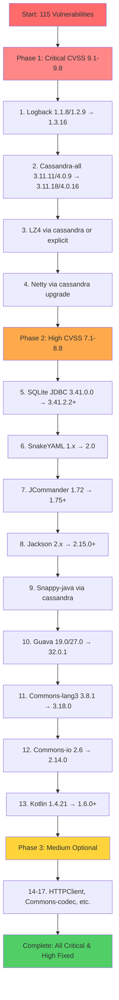
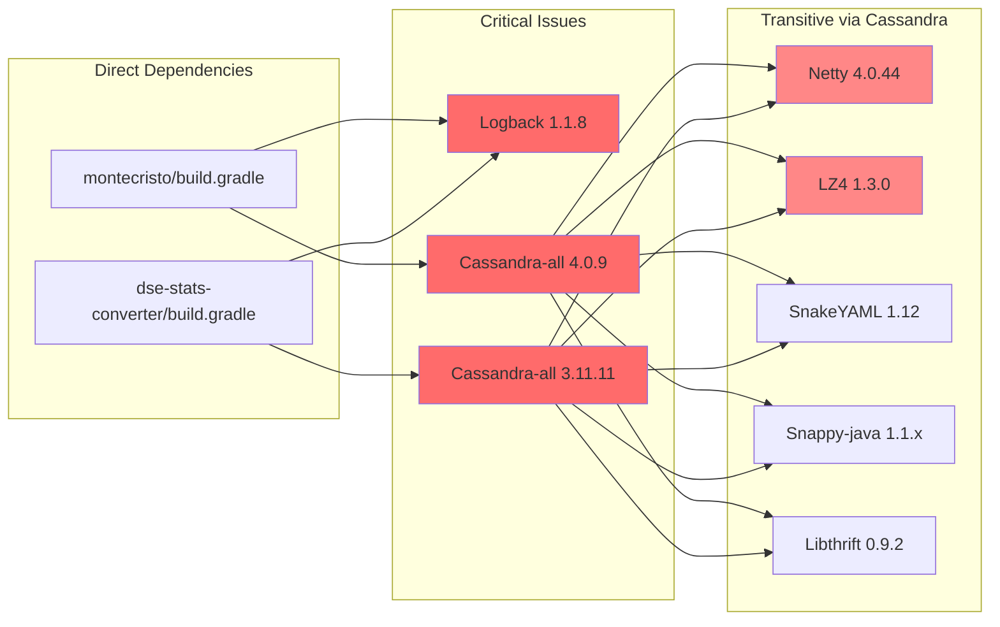
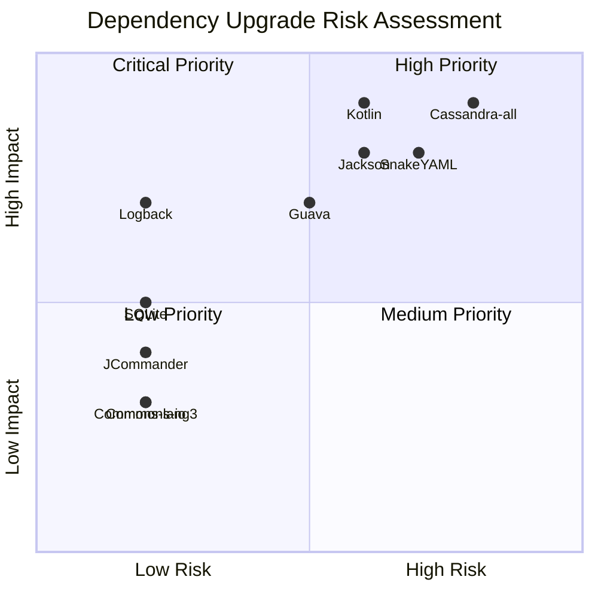
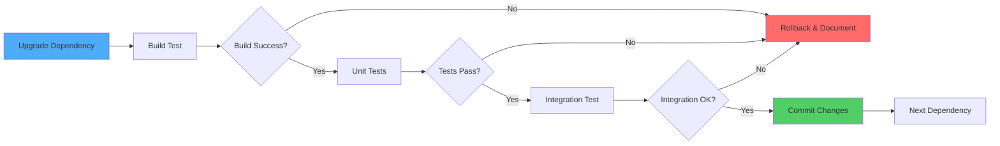

# Dependency Upgrade Sequence

## Upgrade Order (Priority-Based)

This document outlines the recommended sequence for upgrading dependencies to fix security vulnerabilities.

## Dependency Relationships

## Risk vs Impact Matrix

## Testing Strategy Per Phase

## Estimated Timeline

| Phase | Dependencies | Est. Time | Cumulative |
|-------|-------------|-----------|------------|
| Phase 1: Critical | 4 upgrades | 6-12 hours | 6-12 hours |
| Phase 2: High | 9 upgrades | 9-18 hours | 15-30 hours |
| Phase 3: Medium | 4 upgrades | 2-4 hours | 17-34 hours |

## Key Decision Points

### 1. Cassandra-all Version Choice
- **Option A**: Stay on 3.11.x → 3.11.18 (safer, fewer changes)
- **Option B**: Upgrade to 4.0.16 (more fixes, more testing needed)
- **Option C**: Upgrade to 4.1.8 or 5.0.3 (most fixes, highest risk)

**Recommendation**: Option A for dse-stats-converter, Option B for montecristo

### 2. SnakeYAML Major Version Upgrade
- **Challenge**: 1.x → 2.0 is a major version change
- **Impact**: May require code changes in YAML parsing
- **Mitigation**: Thorough testing of cassandra.yaml and dse.yaml parsing

### 3. Kotlin Version Upgrade
- **Challenge**: Language version upgrade affects entire codebase
- **Impact**: May require syntax updates
- **Mitigation**: Incremental upgrade (1.4.21 → 1.6.0 → 1.7.x if needed)

### 4. Java 8 Constraint
- **Limitation**: Must maintain Java 8 compatibility
- **Impact**: Cannot use latest versions of some libraries
- **Mitigation**: Choose highest Java 8-compatible versions

## Success Metrics

- ✅ **Critical vulnerabilities**: 0 remaining (currently 8)
- ✅ **High vulnerabilities**: 0 remaining (currently 59)
- ⚠️ **Medium vulnerabilities**: Best effort (currently 47)
- ✅ **Build**: Successful with Java 8
- ✅ **Tests**: All passing
- ✅ **Functionality**: No regressions

## Rollback Strategy

Each upgrade will be done in a separate git commit:
1. Create branch: `fix/upgrade-<dependency>-<version>`
2. Make changes
3. Test thoroughly
4. If successful: commit and continue
5. If failed: `git reset --hard HEAD` and document issue

## Next Steps

1. **Review this plan** - Confirm approach and priorities
2. **Approve to proceed** - Get sign-off to start implementation
3. **Switch to Code mode** - Begin implementing upgrades
4. **Test incrementally** - Verify each change before proceeding
5. **Document results** - Track what worked and what didn't